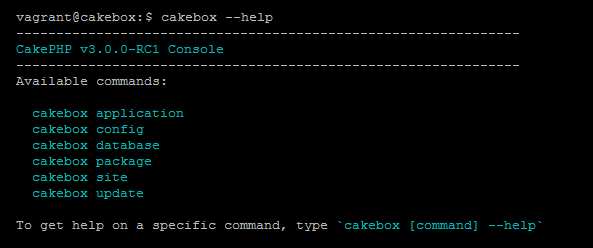

# Cakebox

The only local development server you'll ever need!

Documentation [found here](https://cakebox.readthedocs.org/installation).

## What is it?

Sick and tired of the time and effort it takes to correctly set up webservers,
databases and configuration files before you can actually start developing an
application?

From now on simply run this command inside your box:

```bash
$ cakebox application add my.app
```

Which will result in:

- a fresh copy of your favorite framework
- a new active virtual host
- two new databases (one for test purposes)
- your application fully configured, connected to your database and ready for
development

> Currently supports CakePHP, Laravel, Composer and (public/private) Git
> installations.


## Command Line Provisioning

Easily (re)provision virtual hosts, databases and fully configured applications
using shell commands.



## Admin Dashboard

Comes with a dashboard to keep track of your applications.


## One more thing

You can have yours up-and-running with 3 simple commands, just
[Read The Docs](https://cakebox.readthedocs.org/installation).
