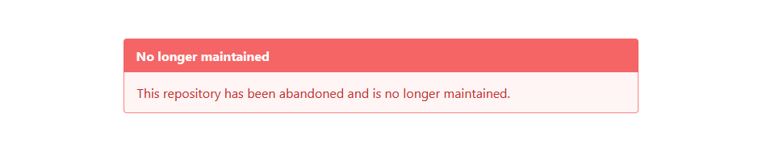
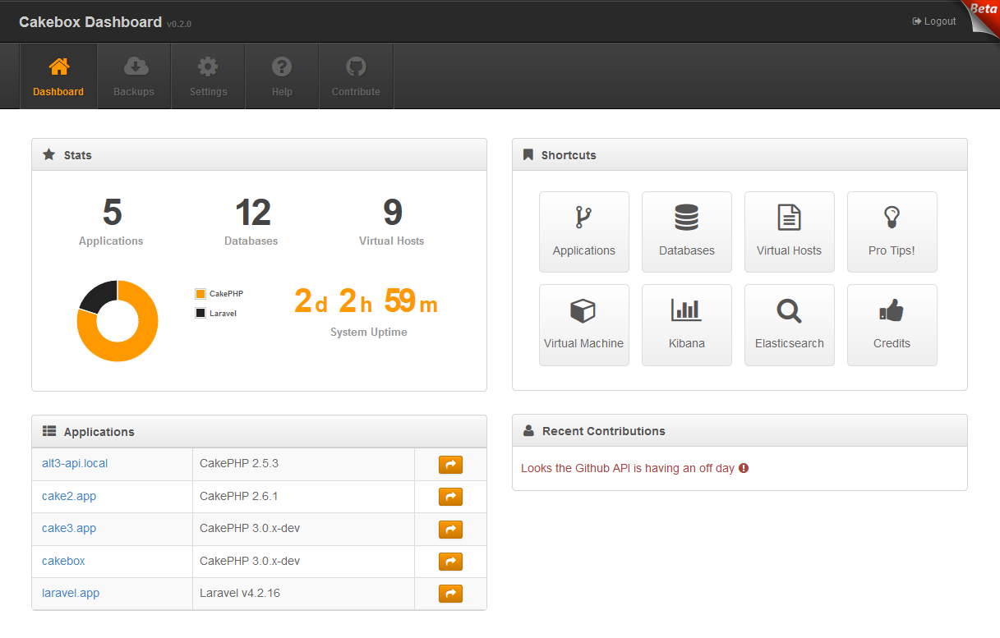

[](https://travis-ci.org/alt3/cakebox)
[](https://cakebox.readthedocs.org)
[](https://packagist.org/packages/alt3/cakebox-console)
[](.cakebox/LICENSE.txt)

# Cakebox

Framework agnostic virtual PHP development environment.



## What do you get?

A 64-bit virtual machine running [Ubuntu](https://wiki.ubuntu.com/LTS)
with PHP and a lot of useful [software and features](http://cakebox.readthedocs.org/en/latest/features/).

> Documentation [found here](http://cakebox.readthedocs.org/en/latest/).

## Requirements

+ [VirtualBox](https://www.virtualbox.org/wiki/Downloads) 4.0 or higher
+ [Vagrant](https://www.vagrantup.com/downloads.html) 1.6.0 or higher
+ a machine with at least 4GB of memory and 2 Cores

**Windows users**:

+ are strongly advised to use the
[Git Bash](http://git-scm.com/downloads) for documented commands
+ may need to [enable hardware virtualization](https://www.thomas-krenn.com/en/wiki/Activating_the_Intel_VT_Virtualization_Feature)
(VT-x)

**Windows 10 users** must additionally:
- use latest VirtualBox and Vagrant
- set `VBoxManage.exe` compatibility mode to `Windows 8`
- apply this [NDIS6 solution](http://stackoverflow.com/questions/33725779/failed-to-open-create-the-internal-network-vagrant-on-windows10) to fix `VERR_INTNET_FLT_IF_NOT_FOUND` error

## Installation

> **Please note:** that the initial download of the (~2GB) box image will take some time.

```bash
git clone https://github.com/alt3/cakebox.git
cd cakebox
cp Cakebox.yaml.default Cakebox.yaml
vagrant plugin install vagrant-vbguest
vagrant up
```

After the installation has completed you may either:

1. log in to your box (now running Ubuntu 14.04 and PHP 5.6)
2. upgrade your box to Ubuntu 16.04 LTS and **PHP 7.1** or **PHP 7.2** by running:

```
vagrant ssh
/cakebox/bash/ubuntu-16.sh
exit
vagrant reload
```

## Additional information

Once provisioning has completed you are ready to:

- [Create your first website](http://cakebox.readthedocs.org/en/latest/tutorials/creating-your-first-website/)
- Login to your Virtual Machine using the ``vagrant ssh`` command
- Login to your Cakebox Dashboard by browsing to [http://10.33.10.10](http://10.33.10.10)

### Command Line Provisioning

Create fully preconfigured applications, databases and virtual hosts
directly from the command line. Currently supports:

+ CakePHP 2/3
+ Laravel 5
+ Git
+ Composer

```bash
# Fresh preconfigured PHP framework applications
$ cakebox application add mycake3.app
$ cakebox application add mycake2.app --majorversion 2
$ cakebox application add mylaravel.app --framework laravel

# Git or Composer applications (both public and private)
$ cakebox application add mypublic.app --source http://github.com/your-name/repository
$ cakebox application add myprivate.app --source git@github.com:your-name/repository.git
$ cakebox application add myyii.app --source yiisoft/yii2-app-basic

# Databases and virtual hosts
$ cakebox database add holiday2015
$ cakebox vhost add idea.com /var/www/some-idea
```

### Management Dashboard

Comes with a dashboard for your convenience.


