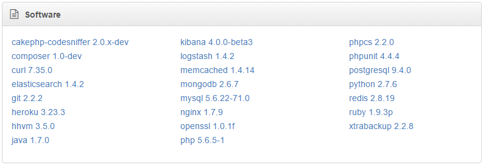

## Feature list

+ Intuitive command line (re)provisioning of:
    - databases
    - virtual hosts
    - fully configured applications
+ Provision applications using Git repositories (both public and private)
+ Provision applications using Composer
+ SSH security done right
+ Highly customizable, Vagrant aware settings
+ Pro tools like Elasticsearch and Logstash
+ Fully functional on Windows (including SSH)
+ A web interface thrown in as a bonus

## Box architecture

To give you a less abstract idea of how your box operates:

> **Note:** the Basebox Build Process is already done for you and is shown for
completeness only.

## Software

Your box runs a 64-bit version of [Ubuntu 14.04.1 LTS](https://wiki.ubuntu.com/LTS)
and comes with a bunch of useful software. Check the ``Virtual Machine`` section
of your Cakebox Dashboard for an actual list.

### Cakebox Commands

Use [CakePHP 3 Console](http://book.cakephp.org/3.0/en/console-and-shells.html)
powered ``cakebox`` shell commands to deploy:

- databases
- websites
- fully configured (public and private) applications

> **Note:** These commands are also used by your ``Cakebox.yaml`` file allowing
> you to (re)create exact copies of your customized box including all installed
> applications, databases and virtual hosts.

### Cakebox Dashboard

Because managing multiple applications just using the command line can soon
become a real bitch we have added a web interface for your conveniece.

