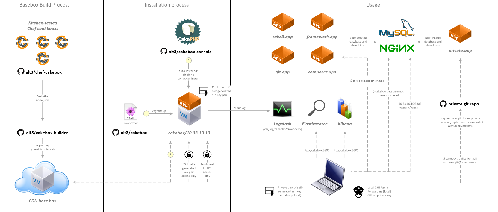

## Beta

We are currently in beta so things may break. Help us improve by
[reporting problems](https://github.com/alt3/cakebox/issues).

## Requirements


+ [VirtualBox](https://www.virtualbox.org/wiki/Downloads) 4.0 or higher
+ [Vagrant](https://www.vagrantup.com/downloads.html) 6.0 or higher

## Windows users

Windows users need additional software to unlock all functionality:

+ [Git Bash](http://git-scm.com/downloads)
+ [Putty](http://www.chiark.greenend.org.uk/~sgtatham/putty/download.html)
+ [Pageant](http://www.chiark.greenend.org.uk/~sgtatham/putty/download.html)
+ [Puttygen](http://www.chiark.greenend.org.uk/~sgtatham/putty/download.html)

> **Note:** this documentation assumes Windows users are using the Git Bash to
> run commands.

## Installation

To launch your box for the first time:

```bash
git clone git@github.com:alt3/cakebox.git
cd cakebox
vagrant up
```

> **Note:** the initial download of the (~2GB) box image could take some time
> so please be patient.

Once provisioning has completed you can:

- login to your Virtual Machine by using the ``vagrant ssh`` command
- login to your Cakebox Dashboard by browsing to ``https://10.33.10.10``

## What's next?

Now that your box is up-and-running you might consider:

+ [creating your first website](additional/tutorial-first-site.md)
+ updating your hosts file
+ [customizing your cakebox](configuration/cakebox-yml.md)
+ [setting up SSH](configuration/ssh-connections.md)
+ experimenting with the ``cakebox`` commands
+ checking the [credentials page](additional/credentials.md)


## Box architecture

To give you a less abstract idea of what your box looks like:



> **Note:** the Basebox Build Process is shown for completeness only.
